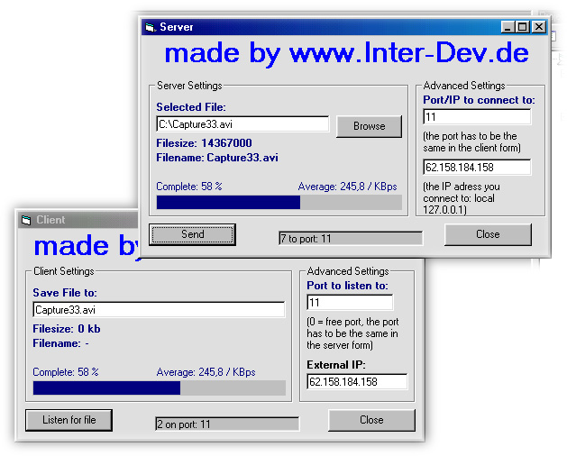

## A\+ Winsock Filetransfer through Internet or Intranet with status bar and average display\. \*easy\*

### Description

http://www.inter-dev.de --> Visit Inter-Dev.de for more!

This code allows you to transfer files from one pc to another using winsock. Well it does not use only api declarations but it works. I comment it in english so i hope you can understand it because i'm german. I made that example because a lot of winsock transfer file toolkits are not precise enought. Some do not use send complete and some examples show you how your file become bigger and bigger after every transfer because they do not check the file size! I do not say that my one is perfect but much better than most of the others. For example I do not like the filesize check-routine... if you know a better way to fix that, please send me your ideas to manager@directbox.com. The "FILEINFO" routine should also made in a better way... you should take another winsock to transfer fileinfos. I also included the transfered bytes per second in that sample!
 
### More Info
 

             |
---                |---
**Submitted On**   |2000-08-09 19:36:08
**By**             |[Hive Alien](https://github.com/Planet-Source-Code/PSCIndex/blob/master/ByAuthor/hive-alien.md)
**Level**          |Intermediate
**User Rating**    |4.7 (47 globes from 10 users)
**Compatibility**  |VB 4\.0 \(32\-bit\), VB 5\.0, VB 6\.0
**Category**       |[Internet/ HTML](https://github.com/Planet-Source-Code/PSCIndex/blob/master/ByCategory/internet-html__1-34.md)
**World**          |[Visual Basic](https://github.com/Planet-Source-Code/PSCIndex/blob/master/ByWorld/visual-basic.md)
**Archive File**   |[CODE\_UPLOAD8804892000\.zip](https://github.com/Planet-Source-Code/hive-alien-a-winsock-filetransfer-through-internet-or-intranet-with-status-bar-and-average__1-10566/archive/master.zip)

